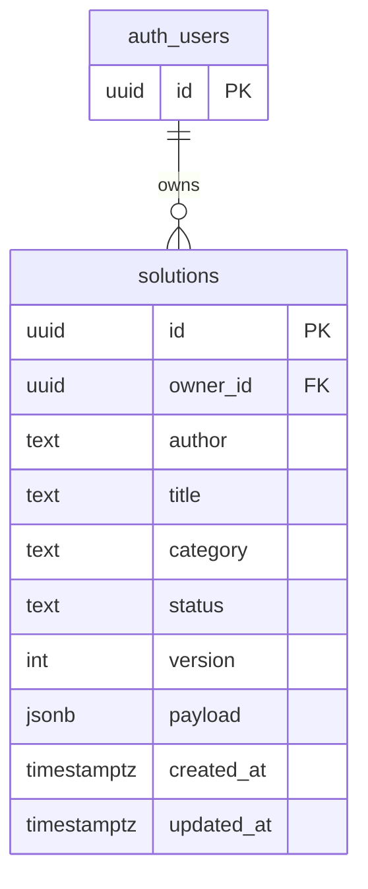
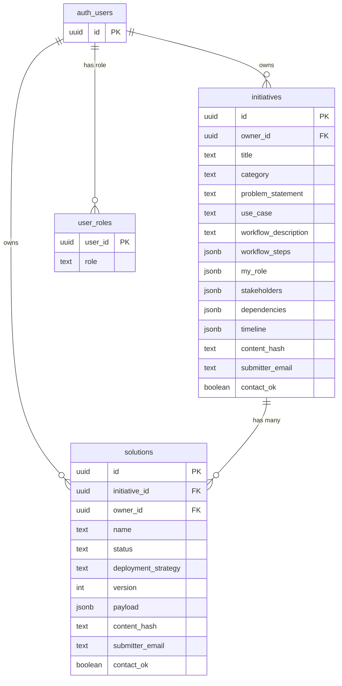

# Supabase Setup — Step by Step (First-Time Guide)

This guide walks you through creating a Supabase project from scratch and
connecting it to the NAF Design Solution Wizard so you can **Save to Database** and
**Load Saved Solution (Database)**.

You do **not** need to know SQL or Postgres. Every step below is copy‑paste or
point‑and‑click. Total time: ~10 minutes.

> Supabase is a hosted Postgres database with a web dashboard. The free tier is
> plenty for this app.

---

## What you'll end up with

- A Supabase project (your own hosted database).
- One table named `solutions` (created by running one SQL file).
- Two values — a **Project URL** and an **anon public key** — pasted into a
  local config file the app reads.

---

## Schema

The schema evolved. **Phase 2 (normalized) is the current, applied schema** —
`initiatives` (problem + border pieces) → `solutions` (six NAF components) +
`user_roles`, with per-owner dedup and RLS. The full DDL is
`supabase/setup_db_auth.py`; applied changes are in `supabase/migrations/`.
Phase 1 (the single `solutions` table) is shown below for history.

> **Branch map — which branch worked on which phase:**
> | Phase | Branch | Status |
> |-------|--------|--------|
> | Phase 1 — validation layer + single-table persistence | `Supabase` | merged to `main` |
> | Phase 2 — normalized `initiatives`/`solutions` + `user_roles` + auth/RBAC | `db-normalization-auth` | merged to `main` |
> | Phase 2c — initiative = rich record (border pieces) + per-owner | `initiative-model-refactor` | merged to `main` (applied) |
> | Phase 2b — Public Solutions + Admin pages (catalog, delete, role mgmt) | `admin-public-catalog` | in review |
>
> Phases 1–2c were merged to `main` as one `--no-ff` merge commit. Phase 2b is on
> `admin-public-catalog`; merge after live verification. No schema change in 2b —
> it only adds UI over the existing `user_roles` / `initiatives` / `solutions`.

### Phase 1 — historical (single-table)

One self-contained table: the whole wizard payload as JSONB, with a few columns
promoted for listing.



### Phase 2 — current (normalized)

The **initiative** owns the problem plus all the "border pieces" (use case,
workflow, my_role, stakeholders, dependencies, staffing/timeline); a **solution**
is just the six NAF framework components (presentation, intent, observability,
orchestration, collector, executor). One initiative → many solutions. Initiatives
are **per-owner** — `unique(owner_id, content_hash)` — so users can each own /
fork a copy of the same problem (a single user still can't duplicate their own).
`user_roles` provides RBAC; RLS: any signed-in viewer reads all, owner/admin write.



> `auth_users` is Supabase's built-in `auth.users` table. Uniqueness is
> per-owner: `unique(owner_id, content_hash)` on each table. `solutions.payload`
> holds only the six NAF components (+ rendered report); border pieces live on
> the initiative. See `supabase/setup_db_auth.py` for the full DDL and
> `supabase/migrations/0002`–`0003` for the applied changes.
>
> **Contact visibility:** `submitter_name` / `submitter_email` are shown by the
> app **only when `contact_ok = true`** (opt-in; default false). The public
> catalog is readable by anyone who signs in, but contact details stay hidden
> unless opted in.

---

## Step 1 — Create a Supabase account

1. Go to **https://supabase.com**.
2. Click **Start your project** (top right).
3. Sign in with **GitHub** (easiest) or an email address.
4. If prompted to create an **organization**, accept the defaults (name it
   anything, e.g. `personal`, plan = **Free**).

---

## Step 2 — Create a new project

1. In the dashboard, click **New project**.
2. Fill in:
   - **Name**: `naf-solution-wizard` (any name is fine).
   - **Database Password**: click **Generate a password**, then **copy it and
     save it somewhere safe** (a password manager). You will rarely need it, but
     you cannot see it again later.
   - **Region**: pick the one geographically closest to you.
   - **Plan**: **Free**.
3. Click **Create new project**.
4. Wait ~2 minutes while Supabase provisions the database. The page will show
   "Setting up project…" and then become active.

---

## Step 3 — Create the `solutions` table

The app ships with a ready-made SQL file that creates the table, indexes,
security rules, and a timestamp trigger:
`supabase/migrations/0001_solutions.sql`.

You can apply it **either** by pasting it into the dashboard (Option A, no
tools needed) **or** by running a Python script (Option B).

### Option A — Paste into the SQL Editor (simplest)

1. In the left sidebar of your project, click the **SQL Editor** icon
   (looks like `</>` or "SQL").
2. Click **+ New query**.
3. Open `supabase/migrations/0001_solutions.sql` on your computer.
4. **Copy its entire contents** and **paste** into the SQL editor.
5. Click **Run** (bottom right, or press ⌘/Ctrl + Enter).
6. You should see **"Success. No rows returned."** — that's expected (the
   script creates objects, it doesn't return data).

### Option B — Run the Python setup script

> Note: the Supabase Python **SDK cannot create tables** (it only reads/writes
> rows). Creating schema needs a **direct Postgres connection using your
> database password**, which this script handles for you.

1. Get a database connection string: dashboard → **Project Settings** →
   **Database** → **Connection string** → **URI** tab. Select the **Session
   pooler** option (it works over IPv4) and copy the URI. It looks like:

   ```
   postgresql://postgres.<ref>:<password>@aws-0-<region>.pooler.supabase.com:5432/postgres
   ```

   The `<password>` is the database password you saved in Step 2. (If the URI
   shows `[YOUR-PASSWORD]`, replace that placeholder with your actual password.)

2. Put it in your `.env` file at the project root:

   ```
   SUPABASE_DB_URL=postgresql://postgres.<ref>:<password>@aws-0-<region>.pooler.supabase.com:5432/postgres
   ```

3. Run the script (installs `psycopg2` automatically via `uv sync`):

   ```bash
   uv run python supabase/setup_db.py --verify
   ```

   Expected output ends with:

   ```
   Migration applied ✅  (table, indexes, trigger, RLS policies created)
   Verified ✅  'public.solutions' exists (current rows: 0).
   ```

   Use `--dry-run` first if you just want to confirm your config is detected
   without connecting. The migration is safe to re-run.

### Verify it worked (either option)

- In the left sidebar click **Table Editor**.
- You should see a table named **`solutions`** with columns like `id`, `title`,
  `category`, `author`, `payload`, `created_at`, etc.

---

## Step 4 — Get your Project URL and public API key

1. In the left sidebar, click **Project Settings** (the gear icon at the bottom).
2. Click **API** (under "Configuration").
3. You need two values from this page:
   - **Project URL** — under "Project URL", looks like
     `https://abcdefghijklmnop.supabase.co`
   - **Publishable (anon) key** — under "Project API keys". Newer projects show
     it as **`sb_publishable_...`**; older projects show the **`anon` `public`**
     key as a long JWT starting with `eyJ...`. Either works — click **Copy**.

> **Which key?** Use the **publishable / anon** key (whichever your project
> shows). Do **not** use the `service_role` key in the app — that key bypasses
> all security rules and must stay secret/server-side only.

Keep this page open (or paste both values into a scratch note) for the next step.

---

## Step 5 — Give the values to the app

The app reads configuration from a local file that is **git-ignored** (it will
never be committed). Pick **one** of the two options below.

### Option A — Streamlit secrets (recommended)

1. In the project folder, there is an example file:
   `.streamlit/secrets.toml.example`.
2. Make a copy of it named `.streamlit/secrets.toml` (same folder, drop the
   `.example`).
3. Open `.streamlit/secrets.toml` and fill in your two values:

   ```toml
   SUPABASE_URL = "https://abcdefghijklmnop.supabase.co"
   SUPABASE_KEY = "sb_publishable_your-key"   # or a legacy eyJ... anon key
   ```

4. Save the file.

### Option B — a `.env` file

1. Create (or edit) a file named `.env` in the project folder.
2. Add these two lines:

   ```
   SUPABASE_URL=https://abcdefghijklmnop.supabase.co
   SUPABASE_KEY=sb_publishable_your-key
   ```

3. Save the file.

> ⚠️ Both `.streamlit/secrets.toml` and `.env` are already in `.gitignore`, so
> your keys won't be committed. Never paste these keys into code or share them.

---

## Step 6 — Run the app and test

1. Start the app from the project folder:

   ```bash
   uv run streamlit run NAF_Framework_Solution_Wizard.py
   ```

2. Open the **NAF Design Solution Wizard** page.
3. Fill in at least the required fields so a save is allowed:
   - **Title**, **Description**, and **Category** (these three are required).
4. Scroll to **Save Solution Artifacts** and click **💾 Save to Database**.
   - Success shows: `Saved to database (id: …)`.
   - If you see `Cannot save: … category`, fill in the missing field and retry.
5. Confirm it landed in Supabase: dashboard → **Table Editor** → **`solutions`**
   → you should see your new row.
6. Test loading: near the top of the wizard, open **Load Saved Solution
   (Database)**, pick your saved entry, and click **Load selected**. The form
   repopulates.

That's it — you're running on Supabase. 🎉

---

## Troubleshooting

**The database buttons don't appear / say "Database save is unavailable."**
The app can't find your credentials. Check that:
- The file is named exactly `.streamlit/secrets.toml` (not `.example`) **or**
  `.env`, and is in the project root folder.
- The variable names are exactly `SUPABASE_URL` and `SUPABASE_KEY`
  (`SUPABASE_ANON_KEY` / `NEXT_PUBLIC_*` are also accepted).
- You restarted the app after saving the file.

**"Database save failed" or an error mentioning `relation "solutions" does not exist".**
The table wasn't created. Re-do **Step 3** and confirm the `solutions` table
appears in the Table Editor.

**"Load failed" / permission or RLS errors.**
Make sure you ran the *entire* `0001_solutions.sql` file (it also sets up the
security policies). Re-running it is safe — it uses `if not exists` / `drop …
if exists` guards.

**I pasted the wrong key.**
Go back to **Project Settings → API**, copy the **`anon` `public`** key (not
`service_role`), and update your config file.

---

## Notes on security (for later)

- The table has **Row Level Security (RLS)** enabled. Right now the policies
  allow access to rows whose `owner_id` is empty, so the app works with just the
  anon key and no login. This is fine for single-user / trusted use.
- When you later add **Supabase Auth** (user logins), pass the logged-in user's
  id as `owner_id` when saving, and the existing policies will automatically
  scope each user to their own rows. No schema change needed.
- Never expose the **`service_role`** key in the app or the browser — it
  bypasses RLS entirely.
